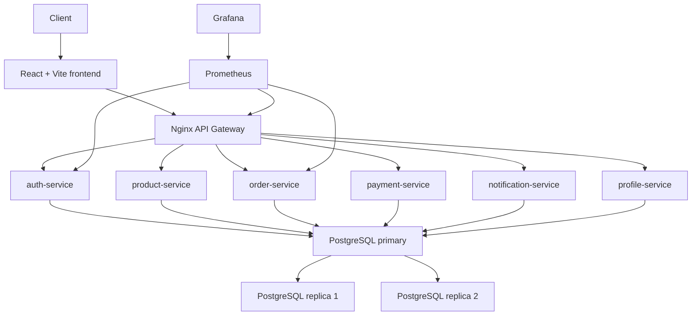

# Architecture

The platform is designed as a true microservice deployment with a separate frontend, centralized API Gateway, independently deployable services, replicated PostgreSQL, and a monitoring stack.

Availability is handled through service replicas, Docker restart policies, Kubernetes Deployments, readiness probes, liveness probes, rolling updates, and PostgreSQL replicas.

